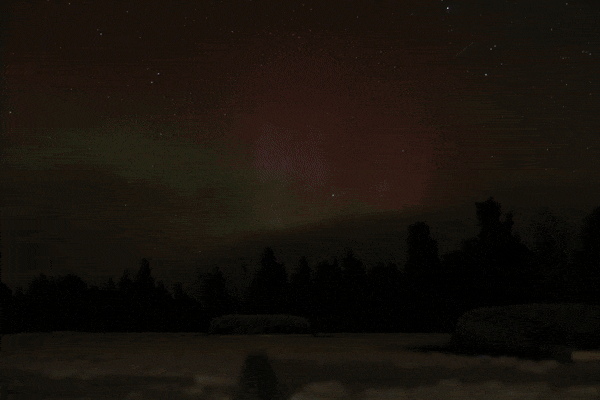

# CameraCommander

CameraCommander is a DIY time-lapse tripod system that pairs a Python CLI application with microcontroller-driven pan/tilt hardware. Capture reproducible time-lapses with a gphoto2-compatible camera while the tripod smoothly moves between positions.

## Project Structure

- **[App](app/README.md)** – Python CLI and Gradio UI to configure the camera and control the tripod.
- **[Firmware](firmware/README.md)** – PlatformIO firmware for the ESP8266 motor controller driving the pan/tilt head.

## Features

- Reproducible time-lapse captures using YAML configuration.
- Serial-controlled two-axis tripod motion.
- Gradio UI for easy configuration file generation.

Refer to the subproject READMEs for installation and usage details.

