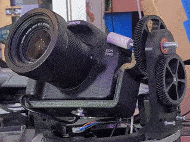

# CameraCommander

Two stepper motors drive pan and tilt. A4988 drivers connect to an ESP8266 (target: ESP32) that keeps motion state and speaks a small serial protocol. A Raspberry Pi Zero 2 runs the Python app: configures the camera via gphoto2, stores images, controls the ESP over serial, and serves a web UI for focus, exposure tests (ISO, aperture), and tripod movement/settings.

What it looks like:

### First moving tripod prototype:

### Part design (via Freecad):
<!-- {width="10px"}
 -->

### Example result time-lapse:
Just camera controls, north of Kiruna, Sweden.

## Quick Start

- App (Python)
  - Requires: Python 3.11+, libgphoto2, ffmpeg (for video), a serial port for the tripod.
  - Run without installing (uv):
    - `cd app`
    - `uv run cameracommander --help`
  - Or install locally:
    - `cd app`
    - `pip install -e .`
    - `cameracommander --help`
  - Use:
    - Build a config: `cameracommander ui` (opens http://localhost:8000)
    - Test shot: `cameracommander snapshot settings.yaml out.jpg`
    - Timelapse: `cameracommander timelapse settings.yaml`

- Firmware (ESP8266)
  - Requires: PlatformIO CLI, NodeMCU v3 (ESP8266), step/dir drivers (A4988/TMC).
  - From repo root (PlatformIO is configured to use `firmware/src`):
    - Build: `pio run`
    - Flash: `pio upload`
    - Monitor: `pio device monitor`

## Structure

- `app/` — Python CLI and Gradio UI
- `firmware/` — ESP8266 PlatformIO source (`src/`)
- `platformio.ini` — Firmware config (points `src_dir` to `firmware/src`)

## Architecture

- CLI (Typer) loads heavy modules lazily. Commands: `snapshot`, `tripod`, `timelapse`, `ui`.
- Camera control via `gphoto2` (`CameraWrapper`), tripod via serial (`TripodController`).
- Timelapse loop: capture → write metadata → move to next absolute pan/tilt → optional ffmpeg render.
- Gradio UI builds/export YAML configs and can run a short prototype timelapse.
