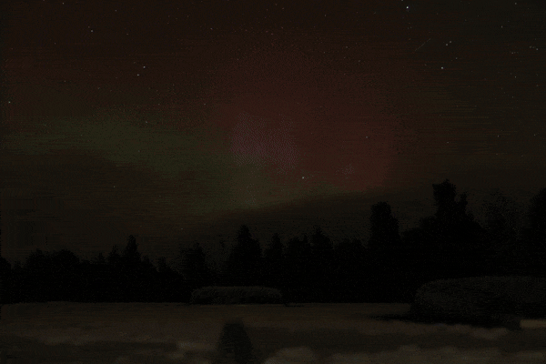
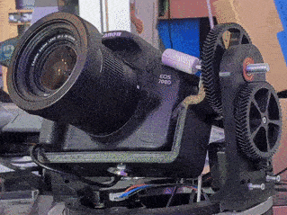
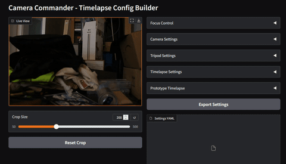

# CameraComander

A CLI application for creating time‑lapse videos using a gphoto2 compatible camera and an optional serial‑controlled tripod. So far it has only been tested with a Canon EOS 6D2 and EOS R50 tethered (USB).
The application allows you to configure camera and tripod settings via a single YAML file to make captures reproducible.
Main function is to capture snapshots and start time‑lapse recordings by continuously capturing images at a given interval. The images are saved to a folder and can be used to create time‑lapse videos, e.g. using ffmpeg.


## Example Workflow (timelapse)
1. Connect camera via USB and attach the tripod controller.
2. Create or adjust `settings.yaml` (e.g. via the Gradio UI).
3. Run `cameracommander snapshot settings.yaml test.jpg` to verify camera settings.
4. Run `cameracommander timelapse settings.yaml` to start a timelapse.
5. By default a video is rendered using ffmpeg. Set `timelapse.render_video` to
   `false` to skip this step on low-resource hardware. The CLI still prints the
   absolute frame directory, a suggested `ffmpeg` command, and an `rsync` command
   to download the images.

Here is one example result of a timelapse created with this tool without any post processing:



Here you see my fully self designed automatic tripod contraption. This is version 0 - prototype design.



## Example `settings.yaml`

```yaml
camera:
  main.imgsettings.iso: 100
  main.capturesettings.aperture: 2.8
  main.capturesettings.shutterspeed: "1/60"
  main.imgsettings.whitebalance: Auto

tripod:
  serial:
    port: "/dev/ttyUSB0"
    baudrate: 9600
  microstep: 16

timelapse:
  total_frames: 100
  interval_s: 10
  settle_time_s: 0.3
  start: { pan: 0.0, tilt: 0.0 }
  target: { pan: 60.0, tilt: 45.0 }
  output_dir: "./output"
  render_video: true  # set false to keep only frames
  video_fps: 25
```

## Camera Wrapper

The `CameraWrapper` provides a thin layer over gphoto2 to apply settings and capture images. It is used internally by other commands and can also be accessed directly from the CLI.

### CLI
Capture a single snapshot using the `camera` section from the config file.
```sh
$ cameracommander snapshot settings.yaml output.jpg
```

## Tripod Controller

The `TripodController` communicates with a serial‑controlled pan/tilt head and is able to move it to absolute angles.

### CLI
Interactively move the tripod using the `tripod` section from the config file.
```sh
$ cameracommander tripod settings.yaml
```

## Gradio Config Creation UI

CameraCommander includes a Gradio‑based web interface that helps build configuration files. Launch it locally or share it publicly.

```sh
$ cameracommander ui [--share]
```



## Commands

The CLI provides several commands to interact with the camera and tripod. Below are some examples of how to use these commands.

### Snapshot
Create a snapshot using the `camera` settings in the given config file.
```sh
$ cameracommander snapshot settings.yaml output.jpg
```

### Tripod
Interactively move the tripod using the `tripod` settings in the config file.
```sh
$ cameracommander tripod settings.yaml
```

### Timelapse
Run a timelapse session using `camera`, `tripod` and `timelapse` sections from the config.
```sh
$ cameracommander timelapse settings.yaml
```

### UI
Launch the Gradio configuration builder.
```sh
$ cameracommander ui [--share]
```

## How to install
### From Source, in a venv
This project uses uv as a package manager. So install it first -> https://docs.astral.sh/uv/getting-started/installation/)

#### Prerequirements
```
apt install gphoto2-dev
```

Then:
```sh
$ git clone https://github.com/fwarmuth/CameraCommander.git
$ cd CameraCommander
$ uv run cameracommander --help
```

### From PyPi
```sh
$ pip install cameracommander
$ cameracommander --help
```

