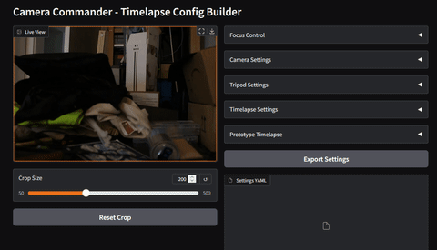

# CameraCommander App

CLI and Gradio UI for time‑lapse capture with a gphoto2 camera and a serial pan/tilt tripod.

Examples:



## Setup

- Requires: Python 3.11+, libgphoto2, ffmpeg (for video), serial port for the tripod.
- Run without installing (uv):
  - `uv run cameracommander --help`
- Or install locally:
  - `pip install -e .`
  - `cameracommander --help`

## Use

- UI (build/export configs, prototype runs):
  - `cameracommander ui`  (use `--share` to expose a public link)
  - Opens http://localhost:8000
- Snapshot:
  - `cameracommander snapshot settings.yaml out.jpg`
- Timelapse:
  - `cameracommander timelapse settings.yaml`
- Tripod (interactive):
  - `cameracommander tripod settings.yaml`

Minimal config (YAML):

```yaml
camera:
  main.imgsettings.iso: 100
  main.capturesettings.aperture: 2.8
  main.capturesettings.shutterspeed: "1/60"
  main.imgsettings.whitebalance: Auto

tripod:
  serial: { port: "/dev/ttyUSB0", baudrate: 9600 }  # Windows: "COM3"
  microstep: 16

timelapse:
  total_frames: 100
  interval_s: 10
  settle_time_s: 0.3
  start: { pan: 0.0, tilt: 0.0 }
  target: { pan: 60.0, tilt: 45.0 }
  output_dir: ./output
  render_video: true
  video_fps: 25
```

Notes:
- Video render needs `ffmpeg`. Set `render_video: false` to skip.

## Mock tripod setup

1. Start the mock firmware server:

   ```
   python -m firmware.mock_firmware_server --host 127.0.0.1 --port 9999 --deg-per-second 60
   ```

   Leave the terminal running; stop it with `Ctrl+C` when finished.

2. Use the sample config `app/settings_mock_tripod.yaml`, which points the tripod serial port at `socket://127.0.0.1:9999`.

3. Run any tripod command against that config, e.g.:

   ```
   uv run cameracommander tripod app/settings_mock_tripod.yaml
   ```

The controller logic is identical to talking to the ESP; swap the `serial.port` back to your COM/USB device when you connect real hardware.
## Layout

- `src/cli.py` — Typer CLI (lazy‑loads heavy modules)
- `src/camerawrapper.py` — gphoto2 wrapper (settings, capture, live view)
- `src/tripodwrapper.py` — serial tripod control (absolute moves)
- `src/timelapse.py` — capture/move loop, metadata, ffmpeg render
- `src/advanced_live_view/` — Gradio UI and helpers

